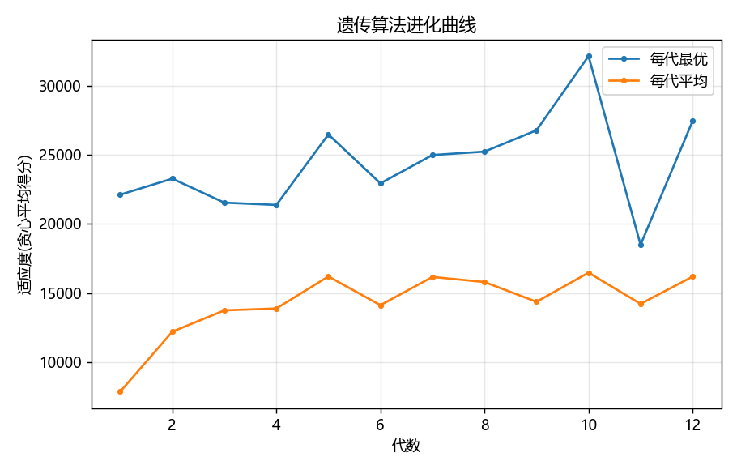
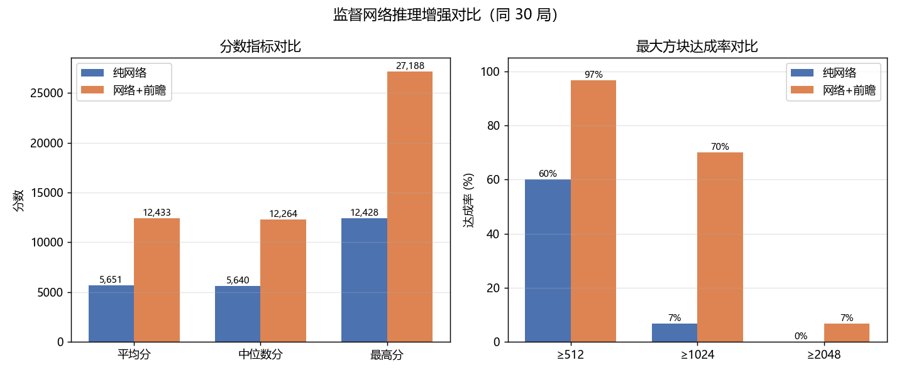
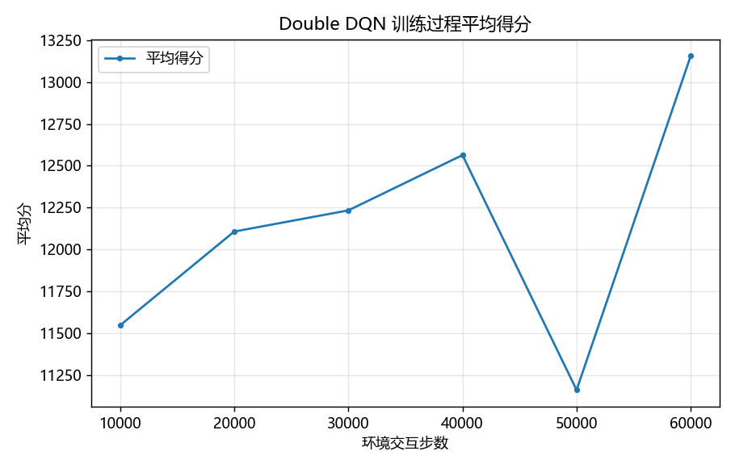

# 2048 多策略人工智能决策系统

本项目围绕经典 2048 游戏，系统实现并比较了多种人工智能决策方法，包括：

* 启发式搜索
* Expectimax 搜索
* 遗传算法
* 监督学习
* 深度强化学习
* 搜索与学习策略结合的混合决策方法

项目的目标不只是让 AI 获得更高分数，还希望探索一个更一般的问题：

> **在随机序列决策任务中，显式搜索、学习型策略以及二者结合的混合方法，各自具有什么优势与局限？**

---

## 项目亮点

* 实现基于人工设计评价函数的 **Greedy Search** 与 **Expectimax Search**
* 使用 **遗传算法（Genetic Algorithm）** 自动优化启发式评价函数权重
* 使用 Expectimax 作为专家策略生成数据，并训练卷积 **Policy Network**
* 实现 **Dueling Double DQN**，并加入 Prioritized Experience Replay、n-step TD 等机制
* 探索 **学习策略 + Search Lookahead** 的混合决策方法
* 实现紧凑棋盘编码和行转移预计算机制，提高搜索与 rollout 的运行效率
* 建立统一实验与结果分析流程，对不同类型 AI 方法进行横向比较

---

# 核心实验结果

| 方法                                |         平均得分 |    平均最大方块 |
| --------------------------------- | -----------: | --------: |
| Random                            |      1,003.4 |        99 |
| Greedy                            |     11,972.5 |       824 |
| Greedy + GA 优化评价函数                | **17,140.0** | **1,182** |
| Expectimax（depth=2）               | **38,402.7** | **2,304** |
| 监督学习 Policy Network               |      5,313.2 |       388 |
| DQN                               |      2,461.2 |       208 |
| DQN + Expectimax Safety Guardrail |  **9,089.8** |   **653** |

实验中有两个比较明显的结果：

### 遗传算法优化启发式函数

遗传算法优化评价函数权重后，Greedy Agent 的平均得分：

```text
11,885.6 → 17,140.0
```

提升约：

```text
+44%
```

### Policy Network + Lookahead

单独使用神经网络策略时：

```text
平均得分：5,651.2
```

加入显式搜索前瞻后：

```text
平均得分：12,433.7
```

提升约：

```text
+120%
```

同时，达到 1024 方块的比例由：

```text
6.7% → 70.0%
```

这一结果说明：

> 学习得到的策略可以提供快速决策，但在需要长期规划的序列决策任务中，显式搜索仍然能够提供重要补充。

---

# 1. 启发式搜索

首先为 2048 棋盘构建可解释的启发式评价函数。

评价函数综合考虑：

* 空格数量
* 棋盘单调性
* 相邻方块平滑性
* 最大方块位置
* 角落偏好
* 可合并方块数量

在此基础上实现两种基础决策方法。

---

## Greedy Search

Greedy 方法枚举当前状态下所有合法动作，对执行动作后的棋盘立即进行评价，并选择得分最高的动作。

基本流程：

```text
当前棋盘
   ↓
枚举合法动作
   ↓
模拟下一状态
   ↓
启发式评价
   ↓
选择评分最高的动作
```

它具有计算速度快、实现简单的优点，但缺少长期规划能力。

---

## Expectimax Search

相比 Greedy 只考虑一步之后的结果，Expectimax 会进一步考虑未来状态。

2048 中既存在：

* 玩家主动选择动作
* 系统随机生成新方块

因此搜索树由两类节点组成：

```text
MAX Node
玩家选择动作

Chance Node
随机生成 2 / 4
```

Expectimax 对随机节点计算期望，并对玩家节点选择价值最高的动作。

因此它能够显式考虑未来多个决策步骤。

在当前实验中，depth=2 的 Expectimax 达到：

```text
平均得分：38,402.7
平均最大方块：2,304
```

是当前实验中表现最强的策略之一。

---

# 2. 遗传算法优化启发式评价函数

启发式搜索的性能高度依赖评价函数中的权重。

人工调整这些参数存在较强主观性，因此本项目进一步使用：

**Genetic Algorithm（遗传算法）**

自动搜索更优参数组合。

优化变量包括：

```text
empty cells
monotonicity
smoothness
max tile
corner preference
merge opportunities
```

最终得到的一组权重为：

```text
empty         =  4.29
monotonicity  =  1.75
smoothness    =  0.48
max_tile      = -0.82
corner        =  3.69
merges        =  2.50
```

实验结果：

| 评价函数    |         平均得分 |    达到 2048 |
| ------- | -----------: | ---------: |
| 默认权重    |     11,885.6 |     2 / 30 |
| GA 优化权重 | **17,140.0** | **7 / 30** |

平均得分提升约：

```text
44%
```



这个实验说明，即使算法框架保持不变，**评价函数设计本身也会显著影响最终决策性能**。

---

# 3. 监督学习策略网络

除了显式搜索，本项目还尝试训练神经网络直接根据棋盘状态预测动作。

首先使用 Expectimax 作为 Expert Agent，自动生成：

```text
棋盘状态 → 专家动作
```

形式的监督学习数据。

整体流程为：

```text
Expectimax Expert
        ↓
生成状态—动作数据
        ↓
棋盘 One-Hot Encoding
        ↓
卷积神经网络
        ↓
动作概率
        ↓
UP / DOWN / LEFT / RIGHT
```

当前实验使用约：

```text
120k
```

条 depth=3 Expectimax 专家样本。

最佳验证集准确率约为：

```text
64.76%
```

但实验中发现：

> 较高的动作分类准确率，并不意味着模型能够获得同等优秀的长期游戏表现。

单独使用 Policy Network 时：

```text
平均得分：5,313.2
平均最大方块：388
```

明显低于作为 Teacher 的 Expectimax。

---

# 4. Policy Network + Search Lookahead

监督学习实验中一个比较明显的问题是：

**网络能够学习局部动作，但缺乏显式长期规划能力。**

因此本项目进一步尝试在推理阶段加入 Search Lookahead。

不重新训练模型，而是在模型给出候选动作的基础上进行额外前瞻。

---

## 实验结果

| 指标      | Policy Only | Policy + Lookahead |
| ------- | ----------: | -----------------: |
| 平均得分    |     5,651.2 |       **12,433.7** |
| 平均最大方块  |       430.9 |          **925.9** |
| 达到 512  |       60.0% |          **96.7%** |
| 达到 1024 |        6.7% |          **70.0%** |
| 达到 2048 |          0% |           **6.7%** |

平均得分提升：

```text
+120%
```



这一结果体现了纯模仿学习的一个局限：

> 即使模型可以较好地模仿专家在单个状态下的动作选择，也可能因为局部预测误差不断累积，而逐渐偏离专家策略。

而加入显式 Search Lookahead 后，可以在一定程度上重新获得长期规划能力。

当然，这也带来了明显的计算代价：

> 推理质量提高，但推理时间显著增加。

因此这里存在一个典型的：

```text
Performance ↔ Computation
```

权衡问题。

---

# 5. 深度强化学习

项目中还实现了基于 DQN 的强化学习方案。

网络采用：

**Dueling Double DQN**

并加入：

* Double DQN target estimation
* Dueling Network
* Prioritized Experience Replay
* n-step TD
* Potential-based Reward Shaping
* Expert Demonstration Initialization
* DQfD-style Training

整体结构为：

```text
2048 Environment
        ↓
State Encoding
        ↓
Dueling Q Network
        ↓
Q(s, a)
        ↓
选择动作
```

---

## Pure DQN vs Search Guardrail

当前实验中，纯 DQN 的表现并不理想。

最终测试：

| Agent                      |        平均得分 |  平均最大方块 |
| -------------------------- | ----------: | ------: |
| Pure DQN                   |     2,461.2 |     208 |
| DQN + Expectimax Guardrail | **9,089.8** | **653** |



这里没有刻意隐藏 DQN 表现较弱的结果。

相反，这个实验说明：

> 更复杂的深度学习算法并不一定天然优于设计合理的传统规划方法。

尤其在：

* 环境交互数据有限
* 训练预算有限
* 状态空间较大
* 奖励稀疏

的情况下，强化学习训练的稳定性仍然是一个重要问题。

另一方面，在 DQN 的基础上加入 Expectimax Safety Guardrail 后，性能得到明显提升，也进一步体现了：

**学习策略与搜索方法存在结合空间。**

---

# 6. 高性能 2048 环境实现

Expectimax、遗传算法和强化学习都需要执行大量棋盘状态转移。

如果每次移动都逐格处理，会产生较大的计算开销。

因此本项目额外实现了一个优化版本的 2048 环境。

核心思路是：

### 1. 使用指数表示方块

例如：

```text
2   → 1
4   → 2
8   → 3
16  → 4
...
```

### 2. 将一整行编码为 16-bit 整数

每个位置使用 4 bit。

### 3. 预计算所有行状态

一行共有：

```text
2^16 = 65,536
```

种状态。

提前计算所有可能行经过：

```text
LEFT
RIGHT
```

之后的结果。

### 4. 运行时直接查表

从：

```text
重复执行移动逻辑
```

变成：

```text
Lookup Table
```

从而降低大量 rollout 和搜索展开时的环境计算成本。

这一优化主要服务于：

* Expectimax
* Genetic Algorithm Fitness Evaluation
* Reinforcement Learning Rollout

---

# 项目结构

```text
.
├── README.md
├── requirements.txt
│
├── src/
│   ├── game/
│   │   ├── board.py
│   │   ├── fast.py
│   │   └── gui.py
│   │
│   ├── heuristic/
│   │   ├── evaluation.py
│   │   └── search.py
│   │
│   ├── evolution/
│   │   └── ga.py
│   │
│   ├── supervised/
│   │   ├── model.py
│   │   ├── generate_data.py
│   │   ├── train.py
│   │   └── lookahead.py
│   │
│   ├── rl/
│   │   ├── env.py
│   │   ├── features.py
│   │   └── dqn.py
│   │
│   └── common/
│       ├── encoding.py
│       ├── runner.py
│       └── plotting.py
│
├── scripts/
│   ├── play_gui.py
│   ├── run_heuristic.py
│   ├── run_evolution.py
│   ├── run_supervised.py
│   ├── run_rl.py
│   └── run_all.py
│
└── results/
    ├── heuristic/
    ├── evolution/
    ├── supervised/
    ├── rl/
    ├── summary.json
    └── summary.txt
```

---

# 环境安装

推荐使用：

```text
Python 3.10+
```

项目开发环境主要为：

```text
Python 3.12
```

首先克隆仓库：

```bash
git clone https://github.com/zhu-yaqi/2048-search-and-rl.git
cd 2048-search-and-rl
```

安装依赖：

```bash
pip install -r requirements.txt
```

主要依赖：

* NumPy
* PyTorch
* Matplotlib
* Tkinter

---

# 快速运行

## 手动运行 2048

```bash
python scripts/play_gui.py
```

---

## Greedy Agent

```bash
python scripts/play_gui.py --agent greedy
```

---

## Expectimax Agent

```bash
python scripts/play_gui.py --agent expectimax --depth 2
```

---

## 运行启发式搜索实验

```bash
python scripts/run_heuristic.py --games 30
```

---

## 运行遗传算法

```bash
python scripts/run_evolution.py --pop 16 --gens 12
```

---

## 训练监督学习 Policy Network

```bash
python scripts/run_supervised.py --samples 15000 --epochs 18
```

---

## 运行强化学习训练

可以先使用较小训练规模检查流程：

```bash
python scripts/run_rl.py \
    --steps 1000 \
    --eval-every 200 \
    --eval-games 3 \
    --final-eval-games 5
```

再根据计算资源扩大训练规模。

---

## 运行完整实验流程

```bash
python scripts/run_all.py
```

实验结果会保存在：

```text
results/
```

综合实验摘要：

```text
results/summary.txt
```

---

# 项目中的一些思考

这个项目除了最终得分之外，也得到了一些比较有价值的实验观察。

---

## 1. 搜索方法仍然是非常强的 Baseline

当前实验中，Expectimax 明显优于学习型方法。

一个重要原因是：

2048 的状态转移规则相对明确，可以通过环境模拟直接进行未来状态搜索。

当模型能够承担一定计算开销时，显式规划具有明显优势。

---

## 2. 动作分类准确率不等于长期决策能力

监督学习 Policy Network 能够学习专家在单个状态下的动作。

但序列决策任务存在一个问题：

```text
一次小错误
   ↓
进入训练数据中较少出现的状态
   ↓
后续预测进一步恶化
   ↓
误差持续累积
```

因此，即使单步分类准确率并不低，也不一定能够复现专家的长期表现。

---

## 3. Search 可以弥补 Learned Policy 的规划能力

Policy + Lookahead 是本项目中比较明显的一个结果。

平均得分：

```text
5,651.2 → 12,433.7
```

说明：

> 学习模型与搜索方法并非只能二选一。

模型可以用于：

```text
快速给出候选策略
```

而搜索可以用于：

```text
进一步进行规划与纠错
```

二者具有较强互补性。

---

## 4. 强化学习并不一定天然优于传统方法

当前实验中，DQN 并没有取得比 Expectimax 更好的结果。

这也说明：

```text
算法更复杂
≠
效果一定更好
```

强化学习性能会受到：

* 数据规模
* Exploration
* Reward Design
* Training Stability
* Hyperparameters
* Compute Budget

等多方面因素影响。

---

## 5. 算法性能和系统实现密切相关

如果环境执行非常慢：

```text
深搜索
大规模 rollout
大量强化学习 interaction
```

都会变得难以实现。

因此优化棋盘状态表示和 transition 速度，也是整个 AI 系统的一部分。

这让我更直观地认识到：

> 算法设计与工程实现并不是完全独立的两个问题。

---

# 局限与后续工作

目前项目主要是一个不同 AI 决策方法之间的实验性比较，并不以提出新的 2048 SOTA 算法为目标。

目前仍存在以下局限：

* 不同算法的计算成本差异较大
* 部分实验由于 Search 成本较高，评估局数并不完全一致
* 强化学习训练预算仍然较有限
* 没有进行大规模 Hyperparameter Search
* Policy + Lookahead 虽然性能明显提高，但推理时间也大幅增加

后续可以进一步探索：

* PPO 等其他强化学习方法
* Distributional DQN
* Learned Value Function + Tree Search
* Model-based Planning
* Adaptive Search Depth
* 更严格的 Compute-Matched Evaluation
* 更大规模的超参数优化
* 学习型策略与搜索策略之间更高效的融合方式

---

# 实验结果

完整实验结果保存在：

```text
results/
```

其中包括：

* 不同方法的 Score Distribution
* Max Tile Distribution
* Genetic Algorithm Optimization Curve
* Supervised Learning Training Curve
* Policy + Lookahead Comparison
* DQN Training Curve
* JSON / TXT 实验汇总

整体实验结果可直接查看：

```text
results/summary.txt
```

---

# 技术栈

```text
Python
PyTorch
NumPy
Matplotlib
Tkinter
```

涉及的主要方法：

```text
Heuristic Search
Expectimax
Genetic Algorithm
Imitation Learning
Deep Reinforcement Learning
Dueling Double DQN
Prioritized Experience Replay
n-step TD
Hybrid Planning
```
